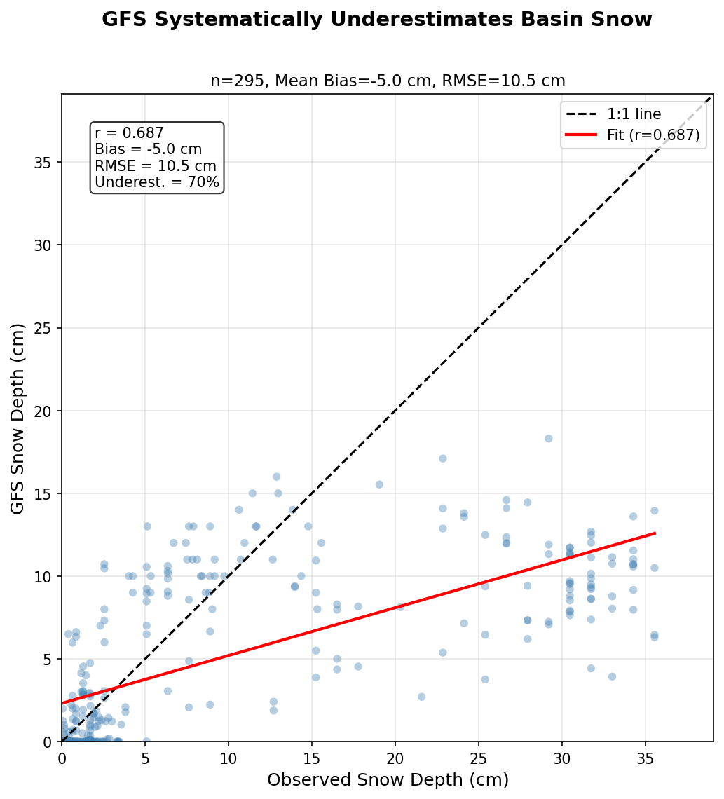
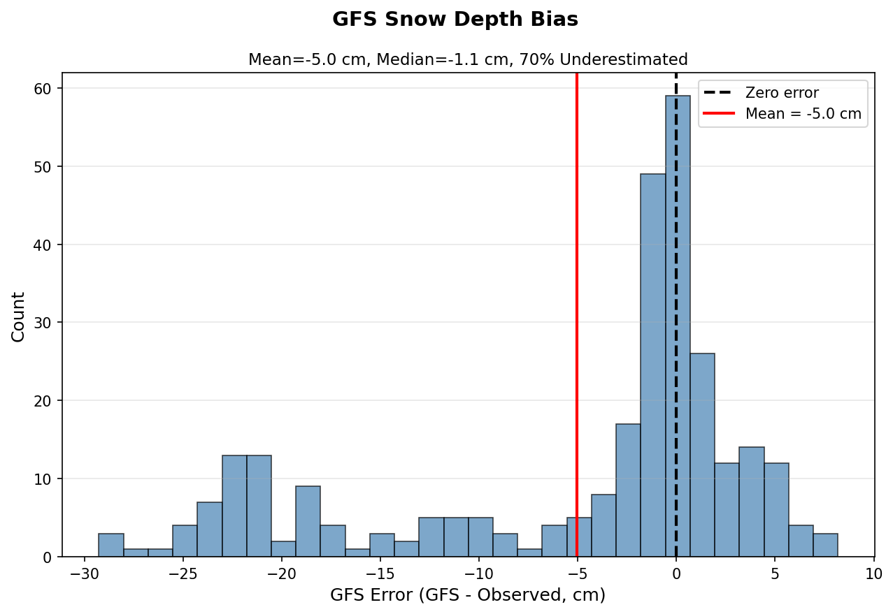

# Case Study Analysis

Three validated case studies for the AMS poster, selected using strict multi-station criteria to ensure data quality.

**Context**: All case studies are from winter 2022-23, which was the most active winter in our 6-year study period (151/193 total exceedances, 78%). Despite this being AQM's "best" winter (POD = 39.7%), performance still loses decisively to persistence (POD = 61.7%).

## Summary

| Case | Date | Station | Obs | AQM | Bias | Validation |
|------|------|---------|-----|-----|------|------------|
| **Worst Miss**¹ | 2023-02-04 | UB7ST | 112 ppb | 54 ppb | -58 ppb | All 5 stations exceeded |
| **False Alarm** | 2021-02-01 | UBCSP | 53 ppb | 87 ppb | +35 ppb | No station exceeded |
| **Best Hit** | 2023-02-08 | QV4 | 76 ppb | 77 ppb | +1 ppb | All 5 stations exceeded |

¹ Selected by largest single-station bias, not highest observed concentration

## Meteorological Context

| Date | Case | Snow | ΔT (°C) | Wind | RH | Obs | AQM |
|------|------|------|---------|------|-----|-----|-----|
| 2023-02-04 | Worst Miss | 12.5" | 19.3 | 1.3 m/s | 79% | 112 | 54 |
| 2021-02-01 | False Alarm | 6.6" | 13.4 | 1.1 m/s | 77% | 53 | 87 |
| 2023-02-08 | Best Hit | 12.5" | 20.4 | 0.9 m/s | 85% | 76 | 77 |

ΔT = diurnal temperature range (smaller = stronger inversion)

## GFS Snow Depth Comparison

| Date | Case | GFS Snow | Obs Snow | Error |
|------|------|----------|----------|-------|
| 2023-02-04 | Worst Miss | 4.7" | 12.5" | -63% |
| 2021-02-01 | False Alarm | 4.3" | 6.6" | -35% |
| 2023-02-08 | Best Hit | 3.4" | 12.5" | -73% |

GFS consistently underestimates snow depth in the Uinta Basin by 35-73%.

### Full Dataset Verification (n=295 days)

The 3 case studies above are validated against the full 6-winter dataset (Dec-Mar 2019-2025):

| Metric | Value |
|--------|-------|
| Matched days (snow > 0) | 295 |
| Mean GFS snow | 5.3 cm |
| Mean Observed snow | 10.3 cm |
| Mean Bias (GFS - Obs) | -5.0 cm |
| RMSE | 10.5 cm |
| Correlation (r) | 0.687 |
| Days GFS underestimates | 69.8% |

**By Observed Snow Depth Bin:**

| Obs Snow | Mean Bias | n |
|----------|-----------|---|
| 0-5 cm | -0.0 cm | 155 |
| 5-10 cm | +1.9 cm | 39 |
| 10-20 cm | -4.5 cm | 29 |
| 20+ cm | -19.8 cm | 72 |

**Key Finding**: The full dataset confirms GFS systematically underestimates snow depth, with 69.8% of days showing underestimation. The bias is strongly depth-dependent: GFS performs reasonably for shallow snow (0-10 cm) but severely underestimates deep snow events (20+ cm shows -19.8 cm bias). This supports the case study finding that GFS errors are worst during the heavy snow events most critical for winter ozone formation.

## AQM Error Evolution (Feb 2023 Event)

The worst miss and best hit both occurred during the same multi-day event:

| Date | Mean Obs | Mean AQM | Mean Bias | Phase |
|------|----------|----------|-----------|-------|
| Feb 3 | 85 ppb | 64 ppb | -20 ppb | Onset |
| Feb 4 | 102 ppb | 68 ppb | **-35 ppb** | Ramp-up |
| Feb 5 | 115 ppb | 78 ppb | -37 ppb | Peak |
| Feb 6 | 99 ppb | 72 ppb | -26 ppb | Peak |
| Feb 7 | 90 ppb | 76 ppb | -14 ppb | Decay |
| Feb 8 | 91 ppb | 80 ppb | **-11 ppb** | Decay |

**Key finding: AQM struggles at event onset, improves as event matures.**

## Baseline Comparison: Persistence vs AQM

### All 6 Winters (2019-2025)

| Model | POD | CSI | Notes |
|-------|-----|-----|-------|
| **Persistence** | **61.7%** | **44.6%** | Simple "tomorrow = today" |
| AQM (All winters) | 31.6% | 27.9% | Overall performance |
| AQM (2022-23 only) | 39.7% | 35.5% | "Best" winter |
| AQM (Other 5 winters) | 2.4% | 2.0% | **Typical winters** |

**Key finding:** A simple persistence forecast ("tomorrow = today") outperforms AQM across all conditions. Even during the most active winter (2022-23), AQM achieves only 39.7% POD vs persistence's 61.7%.

**Devastating finding:** During 5 typical winters, AQM POD collapsed to 2.4% (caught 1 of 42 events), while persistence maintained ~60% skill.

AQM's only advantage: 13.5% onset detection (persistence cannot predict event onset by definition).

## Case Study Details

### Worst Miss: February 4, 2023

- **Selection criterion**: Largest single-station forecast error (-58 ppb at UB7ST)
- Note: Feb 5 had higher peak observed (124.8 ppb at UBHSP) but smaller station bias (-54 ppb)
- All 5 stations exceeded 70 ppb threshold (range: 88-112 ppb)
- Part of multi-day basin-wide event (Feb 3-8)
- Deep snow cover (12.5") with albedo enhancement
- AQM underpredicted by 58 ppb at UB7ST
- GFS underestimated snow by 63%

**Story**: Real basin-wide ozone event that AQM failed to capture at onset.

### False Alarm: February 1, 2021

- No station exceeded 70 ppb (max obs: 54 ppb)
- AQM predicted up to 87 ppb at UBCSP
- Only 6.6" snow (half of real event days)
- Smaller ΔT suggests stronger inversion signal

**Story**: AQM predicted the meteorological setup, but ozone didn't develop - possibly due to insufficient snow for albedo enhancement or missing precursors.

### Best Hit: February 8, 2023

- All 5 stations exceeded 70 ppb
- Same event as worst miss, but 4 days later
- AQM forecast within 1 ppb at QV4
- Model had "caught up" as event matured

**Story**: By event decay phase, AQM had adjusted and produced accurate forecasts.

## Data Quality Notes

Initial analysis found isolated spikes at UBHSP (140-168 ppb) that were rejected:
- Nearby stations showed 45-55 ppb on same days
- Likely instrument errors, not real ozone events

Selection criteria to avoid misrepresentation:
- **Worst miss**: Require ALL stations to exceed threshold; select day with largest single-station bias
- **Best hit**: Require ALL stations to exceed threshold; select day with smallest bias
- **False alarm**: Require NO station to exceed threshold
